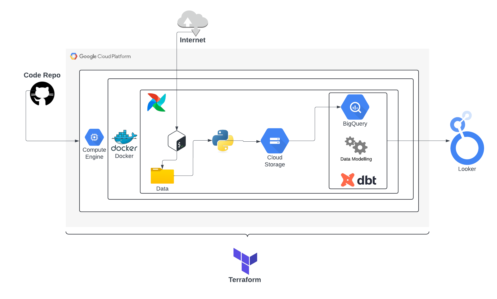

# Real Estate Transactions Dashboard

This project is an end-to-end data engineering project which develops a dashboard to showcase insights into the UK real estate market.

**Dashboard Link 👉:** [LINK](https://lookerstudio.google.com/reporting/0cce3cd0-a312-49ee-b4e9-5439192078ec)



# Project Structure
```
real-estate-dashboard/
├── dags/
│   ├── scripts/
│   └── real_estate_dag.py
├── data/
├── dbt_real_estate/
├── keys/
├── logs/
├── scripts/
├── terraform/
│   ├── main.tf
│   ├── variables.tf
│   └── vm-startup-script.sh
├── docker-compose.override.yml
├── docker-compose.prod.yml
├── docker-compose.yml
├── Dockerfile
├── README.md
├── TUTORIAL.md
└── requirements.txt
```

# Tools
- Docker
- Terraform
- dbt
- Apache Airflow
- Python
- Bash
- Google Cloud

# Tutorial
For a step by step guide to running this project on your local system or Google Cloud check out the [tutorial doc](TUTORIAL.md)